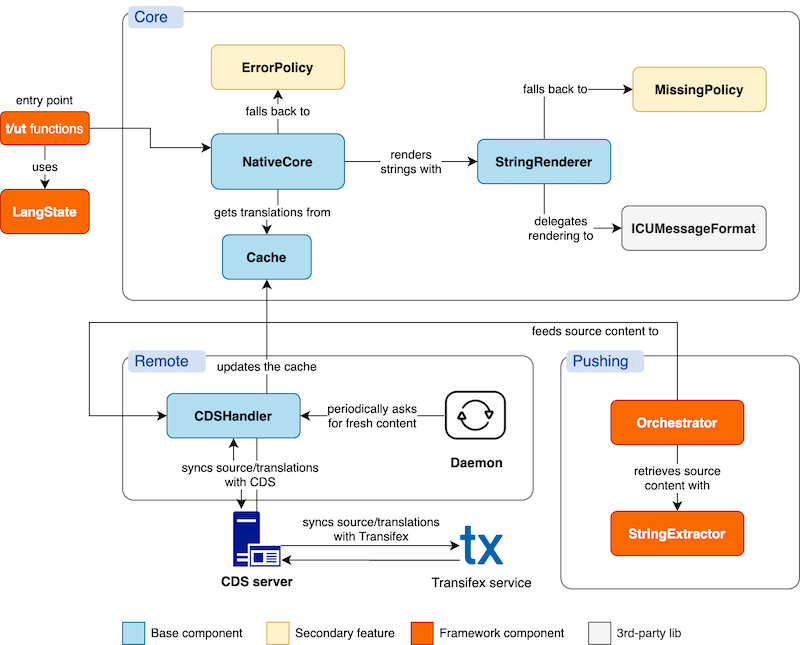

# 1. Core Components

* [1.1 Architecture](#11-architecture)
* [1.2 Core utils](#12-core-utils)

## 1.1 Architecture

The following diagram shows the main parts of any system that implements Transifex Native.

**It doesn’t necessarily mean that each part needs to be implemented as a separate entity (class, module****, etc), but rather shows the different functionalities and responsibilities that a system like this needs to have.**

### Core functionality

This group of components is an autonomous subsystem that can produce the final strings to display to the user, based on the ICU syntax, while getting the available translations from a cache.

#### NativeCore

Orchestrates the string rendering flow. Uses **Cache** to get available translations and **StringRenderer** to get the final translated string.

#### Cache

A storage that holds the available translations. In its simplest form it’s a dictionary/hashmap based on language and string key.

#### StringRenderer

Responsible for taking an ICU string and a set of parameters, and producing the final string to display to the user for a certain language. Uses **ICUMessageFormat** for the low-level work.

#### ICUMessageFormat

This component provides a low-level implementation of ICU’s Message Format syntax, i.e. it knows how to produce a rendered string after replacing all variable placeholders, handling plurals, genders etc.

Depending on the programming language you are developing in, there might be existing 3rd-party libraries that support ICU Message Format.

#### MissingPolicy

A fallback mechanism for displaying something to the user in case a translation does not exist. In its simplest form it falls back to the source string. Usually these mechanisms are convenient during debugging and QA testing, as they make the strings stand out and signify that something’s amiss. A typical example is pseudolocalization, which displays strings like `Ȟêĺĺø, ƒȓıêñđ`.

See other [options and implementation details](#heading=h.8ffp5vpx4b80).

#### ErrorPolicy

A fallback mechanism for displaying something to the user if a translation (or even a source string) has invalid ICU syntax and cannot be properly rendered. An option could be to fall back to the rendered source string and as a second failsafe display the raw source string.

See other [options and implementation details](#heading=h.29yhqp9anpp6).

### LangState & string marking (t/ut)

These are not part of the language core, but are necessary components for integrating the Native SDK on a development framework such as Django, React, etc. Therefore, they are considered framework-specific.

The `t`/`ut` functions are the entry points in the template and language code, as they mark a string as localizable with Transifex Native, and allow developers to enter additional metadata. They are often called "localization hooks". An example is the Django ``  template tag and the Python `t()` function in the [Python SDK](https://github.com/transifex/transifex-python/blob/master/README.md).

The `t` function escapes HTML before rendering the final strings, while `ut` does no escaping.

For uniformity reasons, it is preferred to keep the t/ut naming throughout all Native SDKs. If, however, this is not possible due to language or framework limitations, it is advisable to go with something similar, and short. Keep in mind that t stands for "translate" and ut stands for "unescaped translate".

**LangState** is responsible for keeping the current state related to languages for the application. More specifically, it knows of what languages are available to the application and what the current language is for a specific user session.

### Remote functionality

This part connects the SDK with the world. It is responsible for two things: pushing source strings to [Content Delivery Service](https://developers.transifex.com/docs/content-delivery-service) (CDS), so that they can be translated, and pulling translations from CDS, which end up updating the **Cache**.

CDS is a web service that retrieves and caches translations from Transifex, in order to later serve them to the Native SDK.

#### CDSHandler

Communicates with CDS for pushing and pulling content, using the API of CDS.

#### Daemon

An interval mechanism that tells CDSHandler to request translations from CDS periodically. Its usefulness may depend on the actual framework and environment, so this component can be omitted in certain conditions. For example, it might not be that useful in a typical frontend SDK if the SDK always requests fresh content from CDS every time a page loads.

### Pushing functionality

This part allows the initialization of the translation flow, as it collects and pushes source strings to CDS. **It is typically framework-specific**, as the syntax of marked translatable content can vary among different frameworks, even for the same programming language.

#### Script

Orchestrates the extraction of translatable strings from the project’s codebase and the sending of these strings to CDS. Delegates the actual pushing to **CDSHandler**. Typically it goes through all  files of a project that can host translatable content and extracts the source strings and their metadata.

#### StringExtractor

Knows how to parse the code of a specific framework and detect translatable strings that are marked with Transifex Native syntax.

## 1.2 Core utils

In addition to the high-level components, there are a few core utilities that are necessary for Native to work.

### Key Generation

Each source string (phrase) is associated with a *key*. Keys are automatically generated using the source string and its context, if the latter exists. They look something like `4ffa67a7b40f7d50816524fbce71d4f0`.

See [Implementation details](#heading=h.vtasjxv2sbj4).

Note: The SDK could also give the option to developers to provide a custom key for a string. This way, keys can be readable strings instead of randomly-looking alphanumeric strings.

### HTML Escaping

In order to prevent XSS attacks, the text that will be rendered in the browser needs to be escaped. Therefore, a utility function that escapes certain HTML characters needs to be implemented. By default, all rendered strings should be escaped, unless explicitly defined through an "unescaped" marking.

In particular, the following replacements need to be made:

* `&` becomes `&amp;`
* `<` becomes `&lt;`
* `>` becomes `&gt;`
* `"` becomes `&quot;`
* `'` becomes `&#039;`

### Plural handling

Transifex Native depends on the ICU Message Format to deal with plurals. Depending on the locale, different [plural rules](https://unicode-org.github.io/cldr-staging/charts/37/supplemental/language_plural_rules.html) are supported. For example, English and French have 2 plural rules, singular and plural. e.g. "one chair, two chairs, one hundred chairs".

On the other hand, Arabic supports all 6 plural rules: zero, one, two, few, many, other. Languages that have only one rule it’s always other.

In addition to these names (which is also supported by ICU), Transifex Native uses a numeric index for each one of them. Here is a list of all the rules and their index:

* `0`: `zero`
* `1`: `one`
* `2`: `two`
* `3`: `few`
* `4`: `many`
* `5`: `other`

Not all strings are pluralized. Actually, most strings of an application are typically non-pluralized. Native SDKs need to know how to deal with pluralized strings, as well as the available plural rules. More on that later.

    <a href="index.html">← Overview</a> <a href="implementation_guide.html">Implementation  guide →</a>

