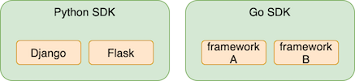

**Transifex Native** is an end-to-end cloud-based localization stack that brings a new paradigm to the continuous development and localization workflow. One of its main components is the SDK. This document provides all necessary information to developers that want to create a Native SDK on a new programming language or framework.

# Contents

* [Overview](#overview)
* [Core components](core_components.md)
* [Implementation guide](implementation_guide.md)
* [Content Delivery Service](cds.md)

# Overview

Examples of Transifex Native implementations:

* [Transifex Python SDK](https://github.com/transifex/transifex-python/)
* [Transifex Javascript SDK](https://github.com/transifex/transifex-javascript)

## Library Structure

**For each programming language, a new SDK should be created**, and it should be in its own repository. If possible, the code for supporting specific frameworks written in this programming language should be included in the same SDK and repository (monorepo). For example, Django support is part of the Python SDK, bundled in one codebase and one repo.

It is recommended that the architecture is made in a way that the language domain is decoupled from the framework domain. For example, any functions, classes, or modules that are framework-specific should be in a corresponding folder structure in the library, and the language (generic & reusable) files should be in a different folder. This way, frameworks that will be added in the future will be able to reuse existing code.

*Language (generic) code should not depend on framework (specific) code, while the opposite is expected and encouraged.*

    <a href="core_components.html">Core components →</a>

